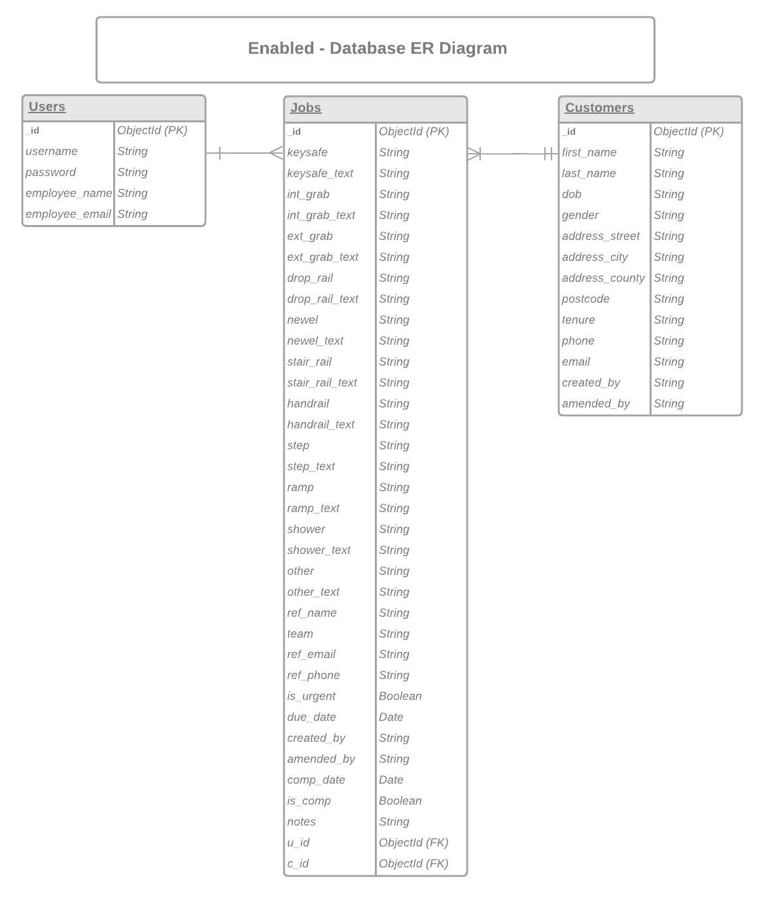

<h1 align="center"><strong>Enabled</strong></h1>

View live site [here.](https://bit.ly/3IvP6Mw)

# **User Experience (UX)** 

## **Brief**

The local authorities Aids & Adaptations service, which provides equipment and in-home adaptations to vulnerable disabled and elderly residents within the borough, are looking for a solution to improve information sharing between service departments. The current service is spread across multiple authority departments and agencies, all using different software packages for their needs but which don’t communicate with each other. Thus, being reliant on the use of email, chat services (such as MS Teams), and telephone to request and share information relating to orders being requested.

The service provider is asking for a software solution that will enable better access to information and more effective communication between departments. They wish to start with the Minor Works ordering service and, later, on appraisal, expand the system to be used by other services.

#
## **User Stories**
### **Regular Staff User Goals**
A regular staff user should be able to:
  - log in securely
  - view their own details and change their password
  - easily and intuitively navigate the site
  - search for and view customers details
  - add and amend customers details easily
  - create Minor Works orders easily and intuitively
  - set orders as completed
  - view and amend Minor Works orders
  - add and update notes on Minor Works orders
  - delete orders only if created by them

### **Admin User Goals**
In addition to regular staff users, an admin user should be able to:
  - manage user accounts by being able to:
    - create new users
    - search and view user details
    - amend user details
    - delete user accounts
  - delete customer accounts

[Back to top](#user-experience-ux)

#
## **Design**
### **Colour Scheme:**
  - Shades of blue and grey as is common within corporate colour schemes

### **Typography:**
  - Google Fonts
    - Main text - [Montserrat](https://bit.ly/3MgPTDs)
    - Logo - [Caveat](https://bit.ly/35dPf90)

### **Imagery**
  - Font Awesome for icons used throughout - [link](https://bit.ly/3tfSjJN)
  - Image on login/welcome page taken from [Clarion Housing](https://bit.ly/3tdXhXn) website (result of Google image search)

### **Wireframes**

Wireframes for desktop, tablet and mobile views created using Balsamiq.

PDF links here:
  - [Desktop](docs/readme_items/wireframes/enabled_desktop.pdf)
  - [Tablet](docs/readme_items/wireframes/enabled_tablet.pdf)
  - [Mobile](docs/readme_items/wireframes/enabled_mobile.pdf)

[Back to top](#user-experience-ux)

#
## **Features**

### **Implemented**
**Base features:**
  - Login/Welcome page which features an image and some text
  - Navbar, and side nav in mobile/tablet view, consistent throughout the site
  - Nav and side nav reveal 'Adaptations' link and 'Options' drop down menu only when user is logged in
  - Drop down in navbar features 'My Account' and 'Logout' options, plus 'Manage Users' is displayed for Admin only
  - Log out redirects user back to Log in page
  - Footer, to display consistently throughout the site, featuring copyright and social media links

**Adaptations:**
  - Collapsible that reveals 'Search Customer' feature, 'Create New Customer' form and 'Results' to show the results of the customer search
  - Button in 'Results', revealed with search result, directs user to 'Customer Details' showing more information about the customer
  - Buttons within 'Customer Details' view direct user to 'Edit Customer', 'View Orders, 'Create Order, and 'Back to Search'
  - Edit Customer displays a form to edit customers details with 'Confirm Edit' and 'Return' buttons. A 'Delete Customer' button is revealed only to the Admin user
  - View Orders displays an overview of all the orders created for that customer as well as 'View' and 'Edit' buttons
    - View directs the user to a more detailed view of the order
    - Edit directs the user to a form whereby they can change any details of the order, including add notes. If the user created the order, they can also delete it from here.
  - Create Order displays a form for the user to create a new order for the customer

**My Account:**
  - Button to reveal session users details
  - Button to direct user to 'Change Password'
  - Change Password page displays form to let the user change their password

**Manage Users (Admin user only feature):**
  - Collapsible showing 'Search Users' search bar, 'Create New User' form and 'Results' displaying the search results and 'Edit User' button
  - Edit User button directs the Admin user to a form where they can edit the users details or delete the user - delete user function is not available on the Admin account information preventing Admin from being deleted

### **Future features**
**Adaptations:**
  - Ability to created multiple notes on work orders which are datetime stamped and show which user each one was created by
  - Datetime stamp each order when it is created and amended
  - Addition of Major Works orders
  - Addition of Customer Assessments

**My Account:**
  - Additional check on password change to confirm new password match
  - Stronger password criteria (capital letters, numbers, special characters etc.)

**Manage Users:**
  - Additional user information such as phone number, service area/department
  - Users password reset function

**General:**
  - Notification alerts to let users know their orders have been updated with new notes, order completed etc.
  - Customer portal to allow customers to keep track of orders on their account

[Back to top](#user-experience-ux)

#
## **Database Design**

MongoDB is used to store the data and has been set out in three collections - Users, Customers and Jobs - as shown in the following Entity Relationship Diagram:

(created using LucidChart - [link](https://bit.ly/3qHI00n))

[Back to top](#user-experience-ux)

#
## **Technologies Used**

### **Languages:**
  - HTML 5
  - CSS 3
  - Javascript (JQuery)
  - Python

### **Frameworks, libraries and programmes:**
  - Materialize - used to create layout
  - JQuery - for JS functions
  - Pip - to install required dependencies
  - Git & Github - for version control and code storing
  - Balsamiq - for wireframes
  - LucidChart - for entity relationship diagram
  - Heroku - to deploy live site

### **Database Technologies**
  - Flask-PyMongo to connect Python/Flask app to MongoDB
  - MongoDB - to store database contents

### **Workspace**
  - Gitpod - VSCode based virtual IDE

[Back to top](#user-experience-ux)

#
## **Testing**

Chrome Developer Tool was used to simulate the different viewport sizes for desktop and laptop views, tablet views and mobile views. I used this throughout the development process as well as for testing the website once it was deployed to Heroku.

The deployed website was also tested using Chrome, Edge and Firefox as well as on mobile (using Chrome for Android)

More detailed information of the testing carried out can be viewed in [TESTING.md](TESTING.md)

[Back to top](#user-experience-ux)

#
## **Deployment**

### **Site deployed to Heroku**

**Requirements for Deployment:**
  - Python
  - MongoDB account and database
  - GitHub account
  - Heroku account

**Process:**
  - MONGO_DBNAME - database name needed to be connected to in MongoDB.
  - MONGO_URI - find this on the MongoDB website by following these steps:
    - in the clusters tab of your database, click connect on the associated cluster.
    - click 'Connect', then 'Connect your application'.
    - copy the string, then change the password (from Database access NOT your MongoDB password) 
    - change "myFirstDB" to your MONGO_DBNAME

  - SECRET_KEY - a custom string set up to keep sessions secure. Password generated by [RandomKeygen](https://bit.ly/3IwUxuI)

**Deployment to Heroku:**
  - create requirements.txt file and Procfile by running these commands in terminal:
    - `pip3 freeze --local > requirements.txt`
    - `echo web: python run.py > Procfile`
  - push to repository
  - create .gitignore file if you don't already have one
  - add `env.py` and `__pycache__/` to the .gitignore file and save it. Sensitive information will now not be added to your repository
  - create env.py file with the following information:
    - `import os`

    - `os.environ.setdefault("IP", "0.0.0.0")`
    - `os.environ.setdefault("PORT", "5000")`
    - `os.environ.setdefault("SECRET_KEY", " ## YOUR SECRET_KEY ## ")`
    - `os.environ.setdefault("MONGO_URI", " ## YOUR MONGO_URI ## ")`
    - `os.environ.setdefault("MONGO_DB", " ## YOUR MONGO_DBNAME ## ")`
  
  - log in to [Heroku](https://bit.ly/3HqWiYV)
  - select 'Create New App' in the dashboard
  - choose your app name, select the region nearest you and click 'Create App'
  - go to 'Deploy' tab, 'Deployment Method' and select 'GitHub'
  - search for your GitHub repo and click 'Connect'
  - go to 'Settings' tab, 'Config Vars' and select 'Reveal Config Vars'
  - enter key value pairs from your env.py file
  - go to 'Deploy' tab and select 'Enable Automatic Deployment'
  - choose the branch to deploy from
  - click 'Deploy Branch' to deploy your app onto Heroku servers
  - let app finish building then click 'Open App' to view your site

[Back to top](#user-experience-ux)

#
## **Credits**

### **Content:**
- Minor Works Order form based on the actual form used by Sandwell Council Aids & Adaptations service - example form [here](docs/readme_items/minor_works_form.pdf)

### **Code:**
  - [Code Institute](https://bit.ly/340DcLH) - Task Manager Mini Project by Tim Nelson was used as inspiration and a model for the code in this project 
  - [Materialize](https://bit.ly/3McnNca) for layout - specifically the JQuery code was from here 
  - [Neumorphism.io](https://bit.ly/3Mb2pnN) for shadow effect on login/welcome page
 
### **Media:**
- Welcome/Login page image taken from [Clarion Housing](https://bit.ly/3tdXhXn)

### **Acknowledgements:**
- Thank you to Sean, Ger and Oisin from Code Institute Tutor Support for helping me see the error of my ways... or code and guide me to correct it
- Code Institute for the lessons and support
- Patrick Justus at Harlow College for the additional lessons and insights into web development

[Back to top](#user-experience-ux)
#
