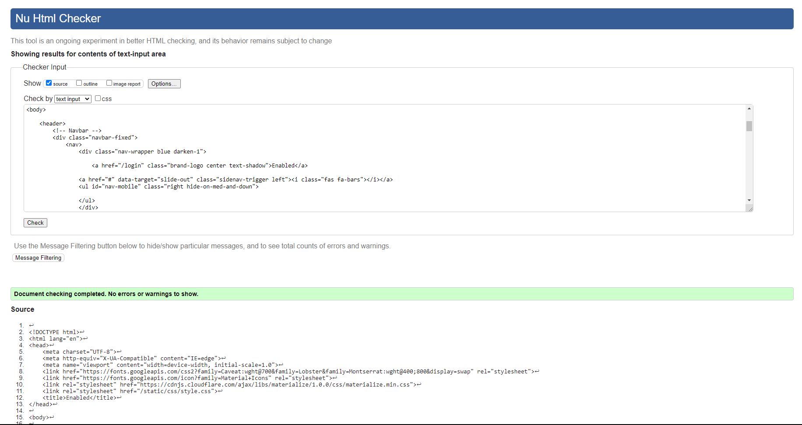
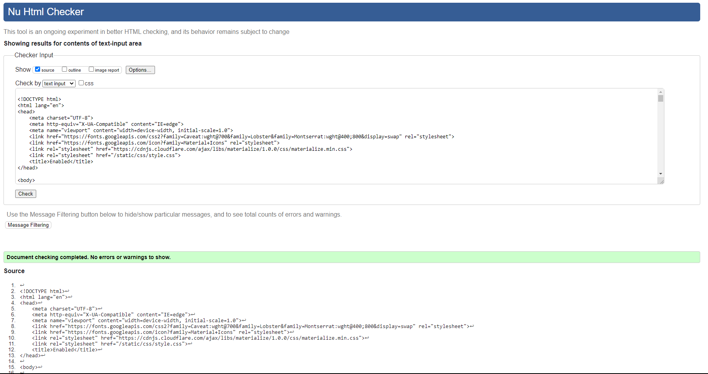
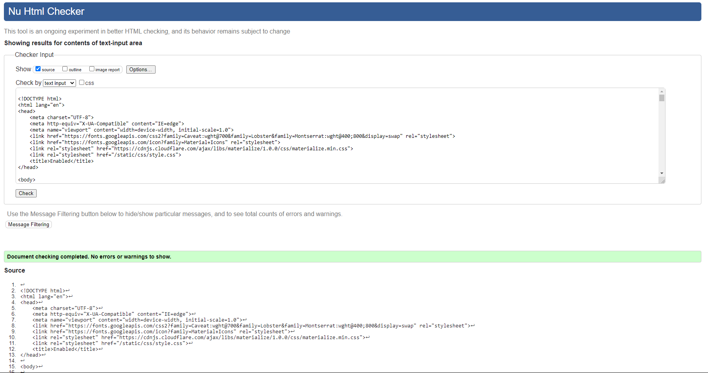
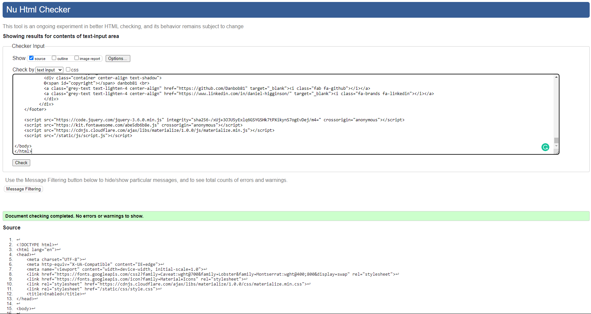
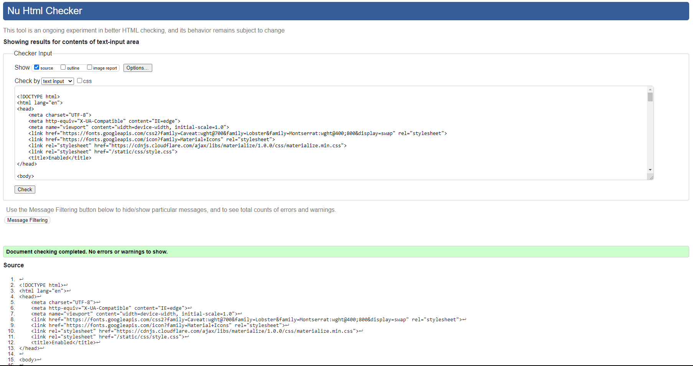
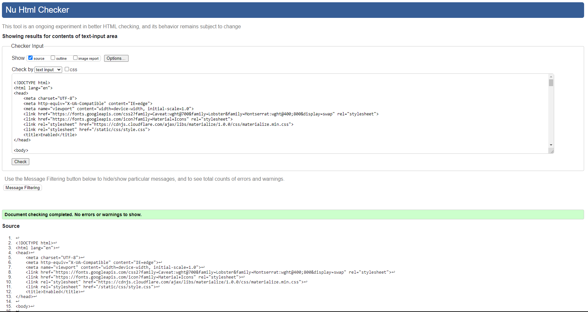
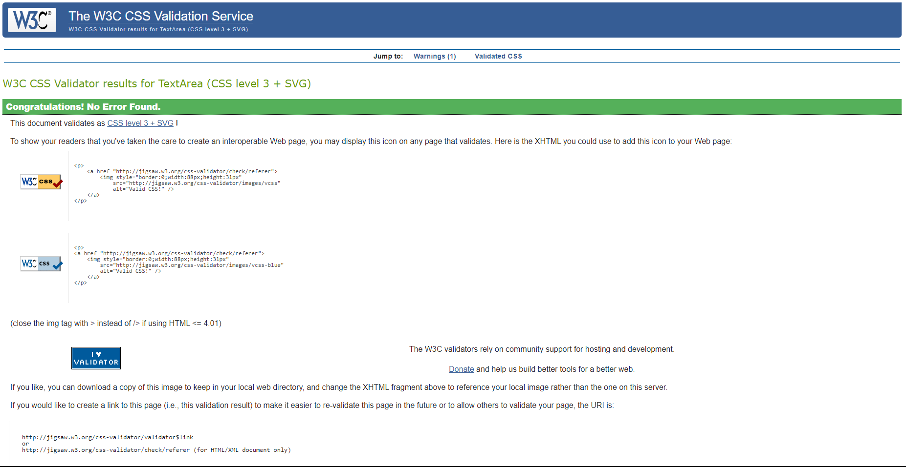
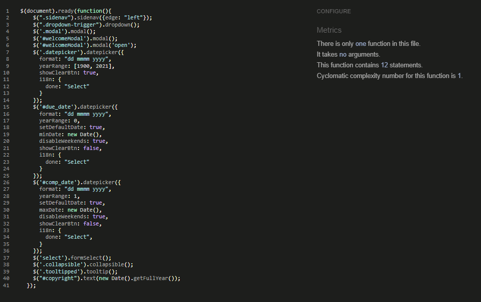
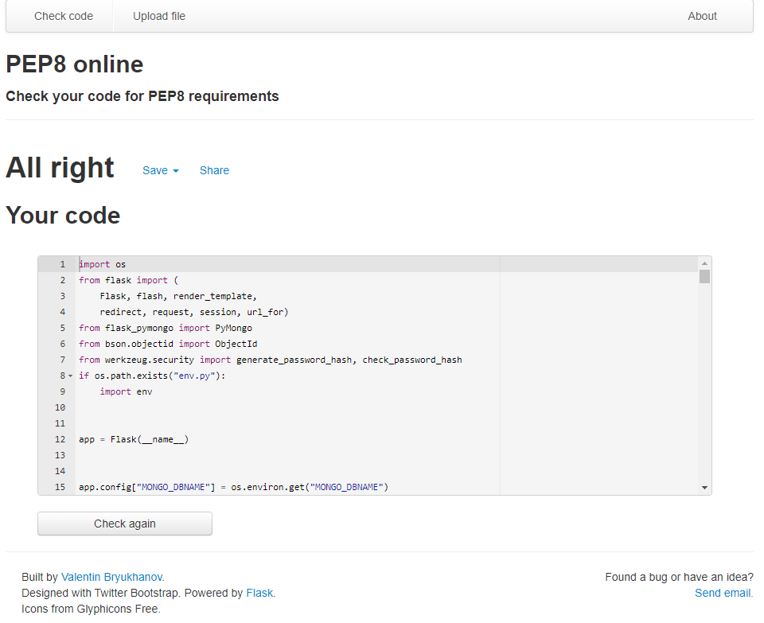

#  **Testing**

Back to [README.md](README.md)

View live site [here.](https://bit.ly/3IvP6Mw)

# 
The site has been tested using Google Chrome, Mozilla Firefox and Microsoft Edge on desktop/laptop as well as Chrome on Android mobile. The Google Developer tool has been used to check the sites responsiveness across various screen sizes (desktop, tablet, mobile).
# 

## **User Story Testing**

### **Regular Staff User Goals**

  - user can log in securely; warning does show if incorrect username or password have been entered
  - managing the user account can be done; all links work as expected. User can view their own details and change their password - warning is given if incorrect password entered
  - the site is easy to navigate with buttons/links clearly defined
  - the user can easily search and view customer details
  - customer records can be created and amended easily
  - Minor Works orders can be created easily with information clearly visible
  - orders can be set as completed making the order only able to be viewed afterwards
  - users are able to view orders and can amend them easily unless set to completed
  - notes can be added and updated on all orders unless order is set to completed
  - if the user has created the order, they are able to delete it. No other user can delete that order

### **Admin User Goals**

  - only the Admin user is able to access the Manage Users section of the site
  - Admin can 
    - create new users easily
    - search for and view user information
    - amend user details
    - delete user accounts except for the Admin account which can not be deleted using the site
  - as well as all the functions of a regular user, the Admin user can delete a customers account

[Back to top](#testing)

#
## **Validator testing:**
### **HTML - [W3C Validator](https://bit.ly/3vkSIx1)** - *passed*

**Login Page:** 
- 

**Adaptations page:** 
- 

**View Jobs page:** 
- 
  
**Manage Users page:** 
- 

**Edit User page:**
- 

**My Account page:**
- 

**Change Password page:**
- 

#
### **CSS - [(Jigsaw) validator](https://bit.ly/3F29Zg1)** - *passed*
- 

#
### **Javascript - [JSHint](https://bit.ly/3jRVMKH)** - *passed*
- 

#
### **Python - [Pep8](https://bit.ly/3qXj7hD)** - *passed*
- 

[Back to top](#testing)

#
## **Additional testing:**
Black box testing was also carried out on the final deployed website.
    
All tests passed. Results can be viewed [here](docs/readme_items/testing/enabled_test_plan.pdf)

#
## **Bugs**

**Found and corrected**

  - a problem was discovered whereby the priority choice would always set to urgent, whether selected or not, upon order creation. 
    - A solution was found by changing the input type from a selector to a toggle switch.
  - when the user made an edit to an order, the edit order page would reload and cause a loop when the user clicked to return to previous page whereby the changes to the order would be resubmitted and take the user back to the edit page.
    - A solution was found by changing the route in app.py to redirect the user back to the view orders page (a better UX solution also)
  - a strange bug was found when the step option was selected when creating an order. The displayed order information in the view orders page would also display the handrail and shower items in the order.
    - An error was found in the code whereby an if statement was incorrectly written with the key word 'step' and returning the 'handrail' and 'shower' options when step was selected. This was corrected and the bug fixed.
  - Change password form was reloading on user clicking the submit button and not updating the password in the DB. 
    - It was discovered, in the change_password function in app.py, that the return statement following the password validation check was causing the page to reload, resetting the form. The return statement was removed altogether and function code re-ordered to solve this issue. (Thank you to Ger in Tutor Support for helping me find and correct this error.)

**No known bugs left unfixed**

[Back to top](#testing)